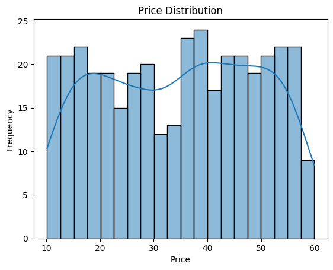
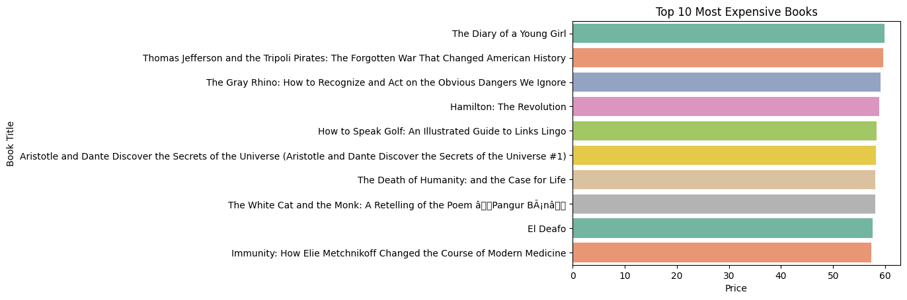
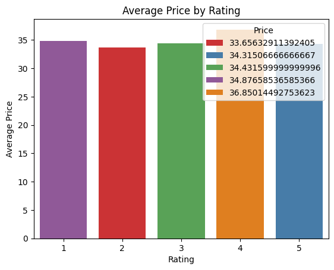

# 📚 Books Dashboard — Automated Report

## ✨ Project Overview
This project automates **book dataset analysis** and generates a professional **Excel report** with insights & charts.  
It is designed as a **freelancing-ready project**: run the script once → get a clean, client-ready Excel file.

---

## ⚡ Key Features
- Automated **Excel report** with multiple sheets
- Visual Charts:
  - 📈 Price Distribution
  - 🏆 Top 10 Expensive Books
  - ⭐ Rating vs Price Relationship
- Clean **Python script** (plug & play)
- Sample **Excel report** already included (`reports/books_report.xlsx`)

---

## 📊 Sample Report Preview
👉 Final Excel file: [`books_report.xlsx`](reports/books_report.xlsx)

- Price Distribution  
  

- Top 10 Expensive Books  
  

- Rating vs Price  
  

---

## 🛠️ Tech Stack
- **Python 3.x**
- **Pandas** → data cleaning
- **Matplotlib & Seaborn** → visualizations
- **OpenPyXL** → Excel export

---

## 🚀 How to Run
1. Clone the repo:
   ```bash
   git clone https://github.com/<your-username>/books-dashboard.git
   cd books-dashboard
